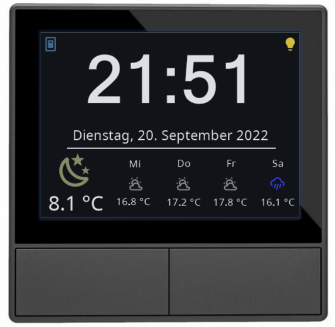

.. index:: nspanel
.. index:: Plugins; nspanel
.. index:: mqtt; nspanel Plugin


===========
nspanel
===========

Das Plugin dient der Ansteuerung von SONOFF NSPanels, die mit Tasmota geflashed sind und das Lovelace-UI benutzen. Das Plugin kommuniziert über das MQTT-Modul.




Anforderungen
-------------
Notwendige Software
~~~~~~~~~~~~~~~~~~~

* Tasmota https://tasmota.github.io/
* nspanel-lovelace-ui https://github.com/joBr99/nspanel-lovelace-ui
* MQTT-Modul

Unterstützte Geräte
~~~~~~~~~~~~~~~~~~~

* SONOFF NSPanel


Konfiguration
-------------

Die Konfiguration des Karten erolgt in der Datei ```nspanel_pages.yaml```

### Hilfreiche Tasmota-Regeln:
Einige Funktionen lassen müssen zusätzlich

Zeige ein Meldung, wenn das NSPanel die WLAN-Verbindung verloren hat:  
```Rule2 ON wifi#disconnected DO Backlog CustomSend pageType~screensaver; CustomSend time~~Keine WLAN-Verbindung; CustomSend date~ ENDON```

Zeige ein Meldung, wenn das NSPanel die Verbindung zum MQTT-Broker verloren hat:  
```Rule1 ON mqtt#disconnected DO Backlog CustomSend pageType~screensaver; CustomSend time~~Keine MQTT-Verbindung; CustomSend date~ ENDON```


Benutze den linken Taster für individuelle Funktionen statt das interne Relais zu schalten:  
```Rule3 ON Button1#state do Publish stat/%topic%/RESULT {\"CustomRecv\":\"event,button1\"} ENDON```

Benutze den rechten Taster für individuelle Funktionen statt das interne Relais zu schalten:  
```Rule4 ON Button2#state do Publish stat/%topic%/RESULT {\"CustomRecv\":\"event,button2\"} ENDON```


Beispiele
---------

ToDo

Web Interface
-------------

SmartHomeNG liefert eine Reihe Komponenten von Drittherstellern mit, die für die Gestaltung des Webinterfaces genutzt werden können. Erweiterungen dieser Komponenten usw. finden sich im Ordner ``/modules/http/webif/gstatic``.

Wenn das Plugin darüber hinaus noch Komponenten benötigt, werden diese im Ordner ``webif/static`` des Plugins abgelegt.
